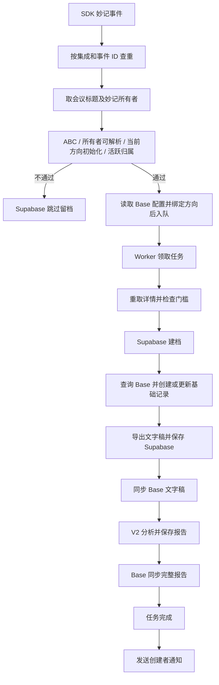
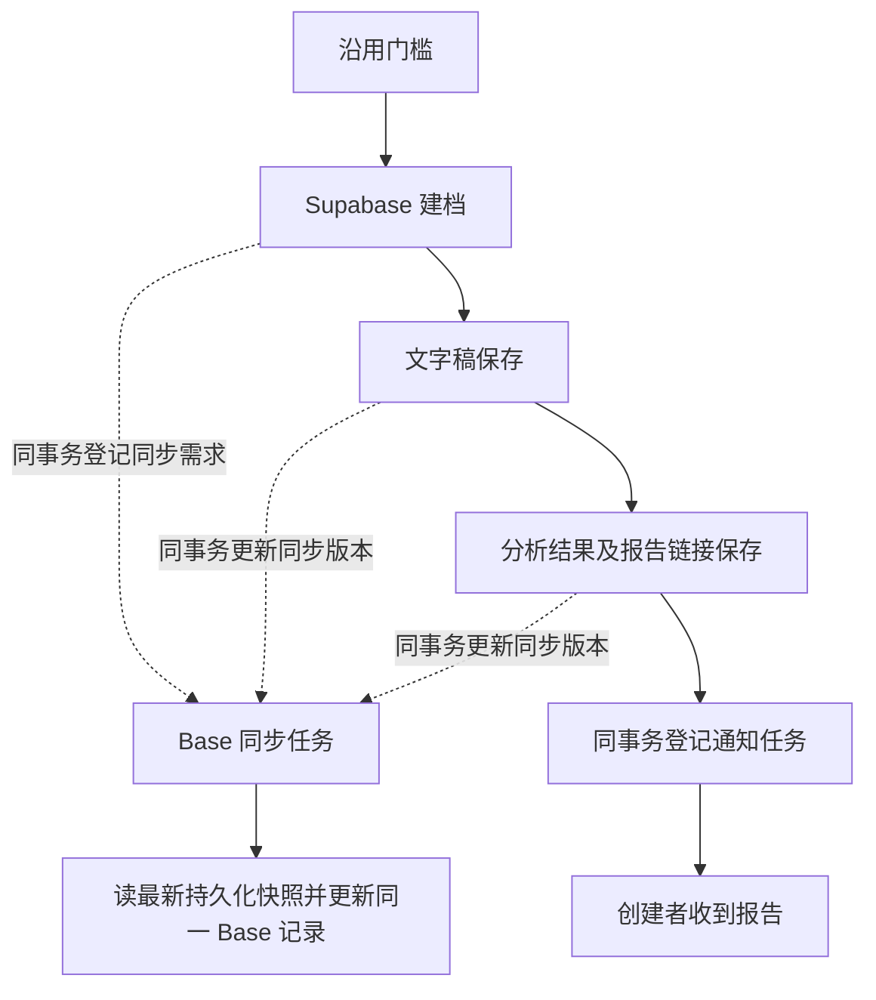

# Teaming Bot 改造前核查与实施方案

核查日期：2026-09-19。代码基线：`11f938b`。状态：设计与只读核查完成，尚未实施业务变更。

本次目标：建立用户集成运营总览，并把会议分析、分阶段 Base 同步、创建者通知解耦。字段 ID 映射由另一个 AI 负责；不修改 V2 分析算法、门槛含义、报告模板、线上数据或用户提供的原始流程图。

## 1. 证据范围与边界

- 已检查：初始化路由/仓储、授权回调、监听启动与清理、会议任务领取/恢复/执行、报告仓储与页面、Base 适配、通知服务、相关 Git 历史、部署文件及迁移目录。
- 已实时只读查询：Supabase `titwuhsuaxsglqonksfw` 的 public 表列、约束、视图及迁移登记。13 张 public 表；无 public 视图；现有会议表有 transcript、analysis_result、analysis_zone。
- 上线人数沿用本次对话前段的已核对快照，不作为本文件发布时的实时人数；实施前应重新查询。
- 测试日志：用户提供的 2026-09-18 10:50–11:30 UTC 文件。首次整段输出截断后，已全文件解析结构化事件并定点读取失败位置。
- 本地已有未跟踪文件 `feishu_event_pipeline_flow.html`，未改动。只读审查业务系统允许产出本说明文件和文档索引。
- 未验证：服务器运行镜像对应的提交、实际运行环境参数、真实 Base 字段清单、端到端新会议、重启和并发故障复现。飞书插件读取曾因授权过期失败；不等于生产机器人授权失效。
- 历史记录用于寻找核查方向；旧记忆中“不保存文字稿”等描述已被当前代码和线上结构否定，不能继续作为事实。

## 2. 当前实际链路

### 2.1 初始化

1. `create-app/route.ts`：无登录态时先创建 pending 用户与会话，再发起 SDK 应用创建。
2. `appRegistrationStore.ts`：创建会话、二维码等待、finalizing/failed 等状态主要保存在进程 Map；部分审计已落库，但不是完整可恢复任务。
3. `appRegistrationService.ts`：拿到创建结果后保存加密凭证，配置/发布应用，更新检查并写审计。
4. OAuth 回调：校验 state，读取用户身份，更新本地用户，保存加密授权，再重置检查状态。
5. 配置页选择方向后触发真实检查；`integrationSetup.ts` 检查应用、OAuth、组织、权限、妙记订阅与监听门槛。Base 不再属于完成门槛。
6. `integrationActivationService.ts` 按 union ID + 组织目标选择最新集成，停用被替代集成；检查通过后更新 success。
7. `eventListenerManager.ts` 建立监听、写 ready 状态；启动恢复失败也会把集成写回 draft，并清空 initialized_at。
8. 清理任务将长时间未完成或被替代的集成软删除；运营统计必须保留“流程结束原因”，不能把删除一律理解为未发生过。

当前 `initialized_at` 在检查成功和监听 ready 时均会重写，失败时可清空；它不是首次完成时间。pending 用户不能直接计为真实人数，姓名不能用作去重键。

### 2.2 会议与交付

关键事实：

- 门槛的 organizer 来自妙记 owner；不以主持人或当前授权人随意兜底。
- 分析调用经 `analysisService.ts` 进入 V2 引擎；网页同步/异步入口也复用此服务。本次不修改分析算法。
- Base 使用平台独立应用；消息使用用户集成对应的应用。两者身份和受众不同。
- 永久报告页只读 Supabase，具备通知不依赖 Base 的基础。
- 旧 `/report?recordId=...` 经 API 按集成和 Base 记录 ID 查数据库；当前 API 已无 Base 内容兜底，与旧文档描述不同。
- Base 阶段性同步基础信息、文字稿、报告；“只展示终态”指处理状态字段，不是只在最终创建记录。
- 当前分析入口仍在读取 Base 判断已处理状态；恢复路径虽称 Supabase-first，仍调用带 Base 写入的 `completeMeetingAnalysis`。

## 3. 已确认问题与待复现风险

| 编号 | 结论与等级 | 证据 | 对方案的影响 |
|---|---|---|---|
| F1 | 日志确认：测试会议 7686829126937971670 在创建记录时失败 | 19:24:59、19:25:37、19:26:48 北京时间均报 1254045 FieldNameNotFound，三次后耗尽；Supabase 建档已成功 | 映射修复归另一个 AI；分析不能依赖该写入成功 |
| F2 | 代码确认：Base 配置、读取和三次写入均嵌入主链路 | Processor 的 enqueue、getMeetingRecordForContext、ensureMinuteRecord、syncPartialFieldsToBase、最终 sync | 解耦必须覆盖全部接触点，不只最后两步 |
| F3 | 代码确认：准备阶段失败统一记为获取文字稿中 | scheduleOrFailMeetingPipelineTask | 传入实际阶段，分离分析和交付错误 |
| F4 | 代码确认：初始化时间会重写/清空 | integrationSetup、监听 ready 和启动失败分支 | 增加独立首次完成事实，不直接改变旧字段门槛语义 |
| F5 | 代码确认：通知前已标记主任务完成，通知失败只写日志/审计 | completeMeetingAnalysis 尾部 | 独立持久化通知任务 |
| F6 | 静态风险：启动恢复直接执行任务，绕过常规数据库领取 | instrumentation 先启动 Worker；recover 函数另行 scheduleBackgroundTask(run) | 收敛到同一领取路径；尚未证实生产重复发送 |
| F7 | 静态风险：批量领取后逐个串行处理，锁无持续续租 | Worker for 循环、claimDue 的 20 分钟过期锁 | 新任务机制需按实际执行容量领取、续租和租约令牌；不能照抄全部实现 |
| F8 | 静态风险：旧目标快照不能完全固定实际 Base | bitableOpenApi 的 getGlobalBitableConfig 读取当前 active project，createOrgTargetBitableAccess 也复用它 | 交付任务固定目标引用/配置版本；项目切换不可改变旧任务目的地 |
| F9 | 线上核对：迁移登记不覆盖当前全部字段 | 线上返回 5 条登记，最后为 20260722122819；仓库有后续迁移，线上也已有部分新列 | 以实际结构比对，不直接执行 db:push 或重放历史迁移 |
| F10 | 代码确认：已有阶段完成记录不等于实时连接健康 | 监听实例 Map、ready 检查记录 | 总览区分最近观察时间与当前未知，不把旧 success 当持续在线 |

未确认为故障：方春剑收到同场事件后读取妙记 403、无法识别所有者而跳过。此分支未阻断王颖入队，不能认定他未初始化。也没有证据说明本场模型或消息接口失败，因为未执行到那里。

约束查询只返回主键，不代表不存在唯一索引；本次不据此提出删除或补建索引。执行迁移前另查 pg_indexes、RLS 和权限。

## 4. Git 历史与不可擅自恢复的设计

| 提交 | 实际改变 | 本次处理 |
|---|---|---|
| 63366e5 | 门槛与 Supabase 数据源同步 | 保留门槛；改执行依赖 |
| 6e7ecdd / 1407fa5 | 项目级配置、集成失活级联 | 保留期次和方向隔离 |
| 5b2af4b / 03b74f6 | 移除 Base 启动门槛、改平台 Base 应用 | 不恢复用户 Base 校验；不替换消息应用 |
| fc07462 | V2 引擎、创建人字段类型 | 不修改分析模板 |
| bc0b21e / 1bb2e4a | Supabase-first 恢复，删除 Base 恢复 fallback | 恢复状态继续以数据库为准，但需解除残留 Base 依赖 |
| 1e78417 / 81f3e96 | 加入后又撤回通知接收人数据库兜底 | 撤回提交只注明 revert，未解释原因；不推断原因、不直接恢复旧补丁 |
| a147c07 / b4dff69 | 综合迁移加入后撤回 | 不恢复被撤回的综合迁移 |
| 1d80a9c / fb1e564 / 11f938b | ABC 门槛、第四期五方向及名称修正 | 原样保留 |

接收人恢复采用新的明确约束：在门槛通过时持久化经过验证的接收人、其所属集成/应用及身份来源，通知只使用这个绑定；缺少证据的历史任务不从参与者、主持人或当前登录人猜接收人。

## 5. 最小目标方案（尚未实现）

### 5.1 保留现有分析任务，增加交付任务

复用现有 meeting_pipeline_tasks 承担分析调度；新增独立交付任务，不让一个 status 同时代表分析、Base 和消息。

- 建档、转录稿、终态各阶段都保留，禁止把 Base 成功作为下一阶段条件。
- 获取文字稿或分析最终失败，也保存真实阶段和错误并登记同步需求；规则跳过仍不写 Base。
- Base 同步合并积压阶段，读取最新完整快照；运营不要求逐次补演所有中间画面。
- 报告可靠保存后主分析任务完成；Base 失败不能把分析成功改成分析失败。
- 状态展示：分析状态、Base 同步状态、通知状态分别展示；可另派生“交付未全部完成”。

建议结构（字段名最终随实现审查确定）：

| 对象 | 关键字段与约束 |
|---|---|
| meeting_records 增补 | 单调递增 data_version；经门槛验证的接收人/来源/应用归属；保留已有报告版本和时间，不拿 schema version 充当每次运行版本 |
| Base 交付任务 | meeting_record_id、integration_id、project_id、target_config_id/version、requested_version、synced_version、status、attempt_count、next_run_at、lease_token/expires_at、错误码、base_record_id；同记录同目标唯一 |
| 通知交付任务 | meeting_record_id、report_revision、integration_id、recipient_open_id、status、attempt_count、next_run_at、lease、稳定幂等键、message_id；同报告版本同应用同接收人唯一 |
| 初始化流程 | attempt_id、user_id、可空 integration_id、project_id（允许待选择）、step/status、step_started_at、last_progress_at、finished_at、错误码及安全摘要 |
| 集成历史事实 | first_initialized_at；历史回填须标注证据来源，缺证据保持未知；现有 initialized_at 暂保兼容 |
| 管理视图 | 集成明细、初始化尝试明细、按项目去重的人数与状态汇总；会议与任务先聚合再关联，避免 join 放大人数 |

### 5.2 数据一致性与恢复

1. 阶段数据与交付需求同事务提交；现有仓储函数需支持传入事务，不可各自提交后再裸发异步调用。
2. 同一记录同一目标只允许一个有效执行者；数据库领取、续租、持有者条件更新。旧租约执行者不得标记新版本完成。
3. 执行时冻结本次数据版本和快照，只确认实际写出的版本；期间新版本到达则保留下一轮待办。
4. 外部 API 与数据库不能构成原子事务。Base 创建成功但回执落库前崩溃时，恢复需按稳定业务标识核对；不靠再次直接创建。
5. 消息请求结果不明需标为 unknown，核查接口幂等能力/有效窗口或人工核对；不能承诺仅靠数据库唯一键实现跨系统绝对一次发送。
6. 旧任务项目/目标固定；不得回退到当前 active project。绑定不可用时暂停该交付，不误投新目标。
7. 所有启动恢复通过同一领取机制；不再扫描后直接执行。删除/停用集成后的待通知任务暂停并记录原因，不自动改换发送身份。
8. 暂不自动补发历史消息。旧 failed/completed 任务先盘点、分类，人工选定恢复范围；仅表格补同步不触发消息重发。

### 5.3 初始化与运营视图

- 首次进入流程即持久化 attempt，早期失败也能统计。SDK 交互状态可继续做缓存，但不能是运营事实唯一来源。
- 重启后不能恢复的扫码交互标为 interrupted/需重新发起，不声称保存一行就能自动恢复 SDK 外部会话。
- 每次步骤状态变化与审计尽量同事务；只记录安全元数据，不把 secret、token、会话凭证放入总览。
- 人数优先按当前可验证的稳定身份去重，缺身份者列为待识别；身份作用域不明时不跨租户自动合并。集成数和人数分别展示。
- “当前期次成功人数”默认排除 deleted/archived/superseded；“历史完成过人数”单独统计，授权失效不抹掉历史事实。
- stalled 是按步骤时限和 last_progress_at 派生的“超时未推进”，与 failed、等待用户操作分开。
- 运行健康保留最近检查/连接观察时间，过期则未知；第一批不重建整套实时监控。
- 管理视图只用于管理员数据库访问，不给普通用户开放跨用户总览。实施时检查 RLS/角色授权，敏感列不入视图。

## 6. 字段映射 AI 的协作边界

- 对方负责：业务字段 → 字段 ID → 飞书请求适配、类型检查、改名兼容；读取、搜索、创建、更新都要覆盖。
- 我方负责：业务快照、目标绑定、版本、调度、错误分类、重试与独立通知。
- 接口应接收显式 target/context 和持久化记录快照；成功返回 record ID；失败提供稳定类别：字段绑定失效/类型不符/权限不足/限流/暂时故障/结果未知。
- target/context 不能偷偷解析当前 active project。共享 bitableOpenApi.ts、bitableSync.ts 的接口改动需先协调，避免覆盖另一方改动。
- 字段配置错误进入 blocked，修复后恢复；限流/暂时网络故障有限退避。全量同步只更新系统管理字段，不清空运营手填字段。
- 不在本轮修改映射，也不向另一个 AI 自动发送消息。

## 7. 实施批次、依赖和停止条件

1. 基线与契约：固定提交、确认字段映射接口、列出受保护行为；补必要故障/幂等测试框架。
2. 增量结构：在隔离测试库验证新表/字段/权限/索引；明确迁移差异，禁止直推生产 schema。
3. 初始化与只读总览：写首次完成事实和流程记录，验证人数去重、软删除和历史时间边界。
4. 分析与交付拆分：移除主流程所有 Base 配置/读写依赖，复用分析任务，增加交付执行器与统一恢复入口。
5. 故障测试：锁、版本、重启、超时结果不明、错误分类与历史兼容。
6. 字段映射联调：合并另一 AI 的接口实现，在测试项目验证三阶段写入和通知。
7. 发布：先兼容性迁移，再暂停/排空旧执行器并切换程序，避免新旧都发送；灰度测试会议后扩大范围。

每批都提供 diff、测试结果、未验证项。回滚保留新增表及交付回执，先停新执行器；不得简单切回会重复发送的旧执行路径。需要先核对线上实际 SHA、镜像和配置（只读，不输出密钥）。

## 8. 验收矩阵

| 场景 | 通过条件 |
|---|---|
| 不含 ABC | gated_skipped，无分析、Base 或报告通知 |
| owner 缺失/未初始化/其他集成 | 保持既有门槛，原因可查，不猜接收人 |
| 标准成功 | Supabase 完整报告；Base 同一条记录阶段更新；一条预期报告通知 |
| 基础 Base 创建失败 | 文字稿及报告继续，通知可成功；修复后补齐一条完整记录 |
| 文字稿 Base 同步失败 | 不影响分析；同步恢复不会覆盖新报告 |
| 消息失败 | 报告与 Base 正常，通知独立恢复，无 AI 重跑 |
| 分析失败 | 保存真实阶段，Base 显示分析失败，不能发送报告成功卡片 |
| 重复事件及并发领取 | 同一分析/交付目标不重复执行副作用；唯一冲突被正确处理 |
| 同步中又生成新版本 | synced_version 只确认旧快照，新版本仍待执行 |
| 请求成功但回执未入库 | Base 核对既有记录；消息按幂等/unknown 处理，不能盲目重发 |
| Worker 崩溃/过期租约 | 可恢复，旧执行者不能完成新租约或写回旧版本 |
| 项目期次切换 | 旧任务目标不漂移，新任务使用新项目 |
| 初始化重复检查/授权失效 | 首次完成不变，当前异常单列，人数不因任务 join 增长 |
| SDK 创建中重启 | 初始化尝试仍可见，必要时提示重新发起 |
| 历史报告 | V1/V2、已有公开 URL、旧 recordId 路径仍按原有可用范围访问 |

## 9. 核查后需要明确的事项

- 必须在发布前确认：运行镜像版本、线上参数与迁移执行方式；目前未连接服务器核对。
- 接口联调前确认：另一个 AI 的字段映射入口、目标绑定方式、错误类型。
- 历史恢复前确认：选哪些任务补同步/补通知；默认不批量补发。
- 业务澄清：妙记所有者是否就是你要的“会议创建者”；当前改造保留既有口径，不以此阻塞本地基础实现。
- 撤回原因未知：不能把 Git revert 自动解释为某个产品决定。新的接收人持久化方案须通过与应用身份一致性的测试。

## 10. 验证记录

- `pnpm tsc --noEmit --incremental false`：退出码 0，通过。
- `pnpm lint`：退出码 0，通过。
- 两项检查首次被包管理器网络访问阻断，联网重试后成功；首次失败不归因为代码错误。
- `git diff --check`：通过。仅新增本说明并更新项目结构文档索引，原始 HTML 未改动。
- 仓库文件搜索及 package scripts 未发现专用自动化测试套件入口；类型/规范检查不能替代行为回归，实施阶段需补充第 8 节对应测试。
- 未运行生产构建和真实服务启动：本轮仅文档变更，且尚未隔离生产凭证和启动副作用。没有新建数据库结构、发消息或执行真实模型调用；不把静态核查当成端到端验收。
