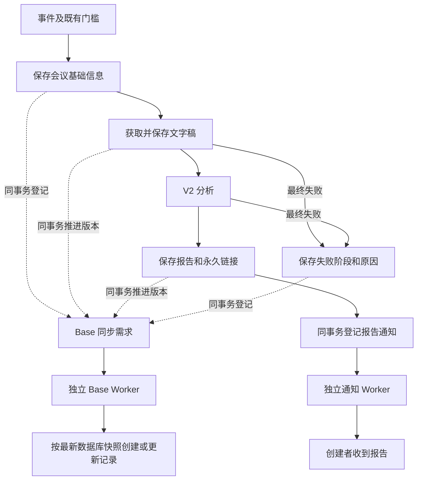

# Teaming Bot 双维度改造执行规格与验收标准

版本：1.0｜日期：2026-09-19｜用途：交给执行 AI 实现与验收

状态：架构执行规格，尚未实现。以已核查代码 `11f938b` 为起点；执行者开始前必须检查最新分支和其他 AI 的改动。本文件规定目标行为；实现命名可以调整，但不得削弱状态隔离、持久化、去重和验收要求。

## 0. 执行摘要与范围

本次实施两个维度：

1. **数据库与运营状态**：运营者在 Supabase 的统一入口查看本期新增用户、姓名、初始化进度、阻塞环节，以及分析、Base 同步、通知的独立结果。
2. **业务链路解耦**：保留 Base 分阶段写入；Base 同步与创建者通知独立于彼此，Base 故障也不阻断分析。

字段 ID 映射由另一项工作负责。本执行任务只消费其接口，协调目标绑定、错误分类和幂等接口，不重新实现字段映射，不擅自改名或新建业务表格列。

不在本次范围：改变 ABC 门槛、改变创建者判断口径、重写 V2 模型/提示词/Zone 算法、报告模板改版、建设完整网页运营后台、批量恢复历史失败任务、批量补发消息。

项目资源：

- GitHub：<https://github.com/LyraWang6688/Teaming-Bot>
- Supabase：<https://supabase.com/dashboard/project/titwuhsuaxsglqonksfw>
- 现状证据：[改造前核查与实施方案](./2026-09-19-改造前核查与实施方案.md)
- 用户原图：`feishu_event_pipeline_flow.html`，保留原件；新增或更新目标设计文档时不要覆盖用户原图。

## 1. 不可破坏的业务约束

| 约束 | 要求 |
|---|---|
| 会议门槛 | 大写 ABC；所有者可解析；当前方向下存在初始化完成、授权有效、启用且未删除的匹配集成；由匹配的当前集成处理 |
| 创建者身份 | 当前实现来自妙记 owner，不能擅自替换为主持人、参会者或当前登录人 |
| 数据源 | Supabase 保存会议、文字稿、报告和处理事实；Base 不再决定分析是否运行或完成 |
| Base 展示 | 基础信息、文字稿、结果分阶段可见；积压时可合并为最新快照；处理状态保持只展示终态的现有约定 |
| 通知 | 报告可靠保存后，使用通过门槛的集成应用向已验证接收人发送报告链接 |
| 隔离 | 集成、项目、方向、目标表和发送应用不能因当前配置变化而静默串用 |
| 历史数据 | 不清理原数据、不恢复用户已删除的记录、不自动重发历史消息 |
| 凭证 | 统一 encrypt/decrypt，仅服务端使用；总览、日志和任务摘要不含明文密钥 |

## 2. 目标架构



关键边界：主流程可以等待 Supabase 事务成功；不得等待 Base API 成功。Base 和通知可使用同一套任务基础设施，但必须有独立领取容量、错误和重试，Base 超时不能占满唯一执行槽并长期拖住通知。

### 2.1 每个阶段的事务边界

| 阶段 | 同一次数据库事务内完成 | 提交后继续 |
|---|---|---|
| 门槛通过建档 | 写基础信息、验证过的接收人绑定、数据版本；登记 Base 需求或目标缺失的阻塞需求 | 获取文字稿 |
| 文字稿就绪 | 写文字稿及分析阶段；增加数据版本；推进 Base 需求 | 分析 |
| 报告就绪 | 写报告、URL、完成时间和报告修订号；增加数据版本；推进 Base 需求；登记通知；完成主分析任务 | 两种交付分别执行 |
| 主分析最终失败 | 写真实失败阶段/错误、完成主任务失败状态；增加数据版本；推进 Base 需求 | 不发送报告成功通知 |

仓储接受事务上下文；禁止“先提交报告，后在内存发起任务”导致崩溃漏交付。已有报告复用时不增加 report_revision，也不重复建通知。V2 的 analysis_schema_version=2 是格式版本，不能当作报告修订号或交付幂等版本。

## 3. 维度一：数据库与运营状态

### 3.1 初始化历史事实

在 `feishu_integrations` 增补：

| 字段 | 类型建议 | 规则 |
|---|---|---|
| first_initialized_at | timestamptz，可空 | 新流程首次全部检查通过时只写一次；复检、重连、授权失效不能覆盖或清空 |
| first_initialized_evidence | text，可空 | live_transition / audit_backfill / unknown；不把当前 initialized_at 直接称作历史首次时间 |

保留原 `initialized_at` 的兼容语义，第一批不要同时修改旧门槛逻辑。两个历史写入入口（检查成功、监听 ready）均使用幂等更新。只有监听 ready 而其他必要条件未满足时，不提前写“首次全部完成”。

历史回填：审计只有最早观察证据时，显示“最早可证实完成时间”，不承诺是第一次；缺证据时为未知。旧项目用户更换方向/集成的历史不可借一次回填统一重置。

### 3.2 新增初始化尝试表 `feishu_setup_attempts`

一行代表一次初始化尝试，第一次点击创建应用时立即落库，不能等 integration_id 产生后才记录。

| 字段组 | 字段建议 |
|---|---|
| 主体 | id、user_id、integration_id（可空）、project_id（可空）、org_target_id（可空）、setup_trace_id |
| 进度 | current_step、status、started_at、step_started_at、last_progress_at、finished_at |
| 结束与错误 | last_error_code、last_error_summary、next_action_code、end_reason |
| 并发与审计 | state_version、created_at、updated_at |

固定步骤建议：create_app / configure_app / oauth / select_direction / permission_check / minute_subscription / listener_connect / completed。

固定状态：running / waiting_user / succeeded / failed / expired / interrupted / cancelled。

- 重发扫码链接、失败后重新开始可创建新 attempt，旧 attempt 明确结束；轮询同一次尝试不重复创建。
- 状态变化和审计一起保存；轮询、页面刷新不得不断刷新 last_progress_at，掩盖长期未推进。
- 更新使用 state_version 或等价条件，防止晚到的旧回调把 succeeded 覆盖为 waiting_user。
- SDK Map 只承担交互缓存；重启后无法恢复的外部扫码会话标 interrupted，并给出重新发起指引。
- 不以本地保存一行数据承诺恢复外部 SDK 注册会话；应用结果已入库时，后续配置优先恢复既有 integration，避免重复创建应用。
- 原软删除清理保留尝试记录并写 end_reason；待用户操作、超时失效、失败、人工取消需分别展示。

### 3.3 运行状态与初始化分离

运行状态来源沿用 authorization、checks、监听观察结果；不把所有状态重复抄到一个字段。

总览输出授权状态、最后检查时间、最后连接观察时间及其来源。超出配置的新鲜度阈值时显示 unknown/stale；历史 success 不能显示成“当前在线”。若需要持久在线判断，再增加轻量监听心跳，禁止仅修改 UI 文案声称已监控。

### 3.4 三个管理员视图

| 视图建议名 | 一行是什么 | 主要用途 |
|---|---|---|
| ops_integration_overview | 一条集成 | 姓名、项目/方向、首次完成证据、当前是否启用、授权与检查、最新尝试、最近会议和待处理交付 |
| ops_setup_attempt_overview | 一次尝试，含无集成者 | 新增、等待、卡点、步骤耗时、错误、下一步操作 |
| ops_project_user_summary | 一个项目 | 去重人数、集成数、初始化进度、当前可用人数、需处理人数 |

统一入口为 Supabase 的视图查询；另外提交只读查询脚本，例如“最近七天新增”“本期完成名单”“当前阻塞清单”。不要求用户手写多表关联；无需本次建设网页后台。

统计口径必须落实为 SQL 与测试：

- 时间一律数据库 UTC；展示标明北京时间，时间范围采用左闭右开。
- 人数按经过验证、作用域明确的身份去重；姓名不能作为键。现有可验证 union_id 可作为作用域内身份；没有稳定身份的临时账号单列为待识别，不混报真实人数。
- 不直接合并 users 行或修改身份体系。跨租户/应用作用域无法证实时，明确标记未知。
- 本期“曾完成初始化人数”和“当前可用人数”分别输出；当前可用沿用项目启用、集成未删除/未替代/启用、当前必要检查和授权口径，并附状态新鲜度。
- 历史完成统计可包含已归档历史事实；当前运营名单默认排除已删除/归档/被替代，并提供明确过滤维度。
- “最近新增”区分首次创建尝试、集成创建、首次完成，不用一个时间字段混用。
- 已成功又开启一个未完成尝试的用户不能被简单算成“从未成功”；展示当前可用集成与未完成尝试两个事实。
- 会议和交付任务先聚合再 JOIN；新增十条会议不应让人数增加十倍。
- stalled 由步骤阈值与 last_progress_at 派生；waiting_user 的超时不冒充系统失败。阈值可配置并在查询结果说明。

权限：这些是管理员视图，不向普通 anon/authenticated 用户授予跨用户总览访问。新表检查 RLS 和授权，视图使用调用者权限或非公开 schema；排除 token、secret、session_token、完整授权 payload。

## 4. 维度二：独立交付的数据结构

复用 `meeting_pipeline_tasks` 作为分析任务；新增以下两张专用任务表，避免一个 status 同时表示三个环节。

### 4.1 会议版本与接收人

`meeting_records` 增补 data_version（每次可同步业务内容变化递增）、report_revision（新报告产生时递增）、recipient_open_id、recipient_app_id、recipient_verified_at、recipient_source。

接收人必须来自通过既有门槛的结果，并与 integration_id、应用归属绑定。恢复任务缺失该绑定时进入 blocked，不能猜测。身份已存在于 organizer_open_id 时可复用列，但必须增加或保留来源和应用证据，避免两套字段各自更新。

### 4.2 Base 任务 `meeting_base_sync_tasks`

| 字段组 | 字段建议 |
|---|---|
| 关联 | id、meeting_record_id、integration_id、project_id、org_target_id |
| 目标 | target_key、target_config_snapshot、mapping_version（由映射接口提供，可空） |
| 同步版本 | requested_version、synced_version（初始 0）、inflight_version |
| 调度 | status、attempt_count、next_run_at、lease_token、lease_expires_at |
| 结果 | base_record_id、last_error_code、last_error_summary、last_attempt_at、last_succeeded_at |
| 通用 | created_at、updated_at |

约束：`(meeting_record_id, target_key)` 唯一；目标 key 稳定且非空。目标配置保存固定项目/表定位信息，敏感定位信息按现有加密策略保存，不复制应用 secret。

项目没有配置目标时，也必须登记 blocked 需求，使用稳定的项目未绑定 key；不能阻止分析或把需求丢掉。管理员补齐该项目目标后，显式绑定并合并冲突任务，不能自动选届时的 active project。

任务状态：pending / running / retry_wait / succeeded / blocked / unknown / cancelled。

- 新版本到达时 requested_version 只增不减；running 不被新事件强制改回 pending，不清除有效租约。
- blocked 原因未解决时，阶段更新只推进版本，不把配置错误反复重新排队。
- succeeded 表示 synced_version 已追上 requested_version；后续新版本可回到 pending。
- 只更新系统管理字段，保留运营手填字段。普通同步不清空已有文字稿/报告；纠错和清除需显式业务规则。

### 4.3 通知任务 `meeting_report_notification_tasks`

| 字段组 | 字段建议 |
|---|---|
| 关联 | id、meeting_record_id、report_revision、integration_id、recipient_app_id、recipient_open_id |
| 内容绑定 | report_url、meeting_title_snapshot、idempotency_key |
| 调度 | status、attempt_count、next_run_at、lease_token、lease_expires_at |
| 结果 | message_id、last_error_code、last_error_summary、last_attempt_at、sent_at |
| 通用 | created_at、updated_at |

唯一约束：同报告记录、同修订号、同发送应用、同接收人仅一条任务。状态与 Base 任务一致；该表的 succeeded 即发送成功。

发送函数移除 base_record_id 必填要求，改以 meeting_record_id/report_revision 追踪。飞书实际返回成功才写成功回执，不把 HTTP 请求结束或 SDK 返回对象等同业务成功。

## 5. 调度、幂等与错误处理

### 5.1 执行器

- 统一从数据库原子领取到期任务；启动恢复只触发同一执行器，不扫描后绕过领取直接运行。
- 按空闲执行槽领取，不先锁一批再长时间排队；分析、Base、通知分别限制并发。
- 使用租约令牌、过期时间和续租。完成/失败/续租都校验持有者，过期执行者不能更新任务回执。
- 只有可安全重试的请求才自动重试；默认最多 5 次尝试，含首次，退避基线 30s/1m/2m/5m 并加抖动；限流尊重 Retry-After。次数和时限可配置。
- 耗尽后转 blocked，写 next_action；支持受控恢复到 pending，并保留旧审计，不能靠改数据库若干字段的手工习惯实现恢复。
- 交付不能重新调用模型；模型任务恢复必须复用已保存报告。外部模型请求已完成但尚未落库的崩溃窗口无法仅凭数据库做到绝对不重复，需如实记录限制。

### 5.2 Base 版本与请求不确定性

1. 领取后固定读取一份数据快照及版本 V；写出的就是该快照，不在同一次请求中拼接不同版本数据。
2. 返回成功后只确认 V；若 requested_version > V，继续待同步。
3. 已知 base_record_id 则更新；不存在时按约定的外部业务标识查找，确认后创建。
4. 稳定标识作用域需与统一目标表一致：推荐 project_id + meeting_id；若产品允许同会议按不同组织分别成行，则加 org_target_id。执行前按现有“创建者唯一处理”规则确认，不能只拿 integration_id 当跨集成重建后的外部行标识。
5. 创建超时或成功回执入库前崩溃，标 unknown，先核对外部是否已有记录；不能直接重发 create。
6. 数据库租约不能阻止已发出的外部旧请求在超时后晚到。对于失去租约或结果不明的写入，恢复需先等待/核对，避免立刻发并行覆盖请求；必要时最终用最新快照再对账。
7. 若飞书缺少可用的条件写入机制，不能承诺所有故障时刻外部数据绝不短暂回退；最低要求是无静默丢版本、异常可见、最终对账恢复最新版本。测试与交付必须披露这个边界。

### 5.3 通知去重

- 数据库唯一任务只能阻止重复建任务，不能单独解决“飞书发送成功、数据库未记回执”的窗口。
- 执行者核实当前飞书接口的幂等参数及有效期，若支持则采用持久化的同一幂等键，不每次重试生成新键。
- 无法可靠去重的未知结果转 unknown，停止自动重发，提供人工核对入口；不得宣称端到端 exactly-once。
- 集成已删除/被替代、应用归属变化、接收人缺失时 blocked，不自动换另一个应用发送。

### 5.4 错误分类

| 类型 | 行为 | 影响范围 |
|---|---|---|
| 字段绑定缺失、字段类型不兼容 | blocked，配置修复后恢复 | Base |
| Base 权限不足、目标缺失 | blocked，明确目标和下一步 | Base |
| 消息接收人/应用权限问题 | blocked，保留接收人绑定 | 通知 |
| 限流、可确认未成功的临时故障 | retry_wait，有限退避 | 对应交付 |
| 请求结果不明 | unknown，核对后再决定 | 对应交付 |
| 文字稿/模型最终失败 | 主分析 failed，保存实际阶段 | 不生成成功通知；Base 尝试镜像失败信息 |

错误摘要遵循“发生了什么、影响什么、下一步怎么做”。记录 error_code、阶段、记录/任务/集成 ID 和时间，不泄露秘密或把 SDK 原始报错直接交给页面判断。

## 6. 映射工作接口契约

对外契约可用等价 TypeScript 实现：

```ts
type SyncInput = {
  integrationId: string;
  projectId: string;
  target: BoundBaseTarget; // 固定目标，禁止内部寻找当前 active project
  businessKey: string;
  sourceVersion: number;
  snapshot: MeetingProjection; // 来自持久化数据，含阶段已有字段
  knownRecordId: string | null;
};
type SyncResult = { recordId: string; operation: 'created' | 'updated' };
// 同步适配器仅执行一次操作，不另建后台重试循环。
// 错误必须可区分配置错误、临时错误及结果不明。
```

映射 AI 提供字段 ID 绑定、名称变更适配、类型检查、查询与写入能力。调度 AI 提供 snapshot、目标、businessKey、版本和 knownRecordId，并负责恢复。两个 AI 共用文件接口先对齐，不互相覆盖。创建者姓名等展示数据也从数据库取得，不能为了 Base 同步重新依赖用户 OAuth 请求。

## 7. 代码修改导航与交付件

| 区域 | 预计工作 |
|---|---|
| `src/lib/db/schema.ts`、新增迁移 | 增补历史事实、初始化尝试、版本与独立交付表；索引、约束、权限 |
| 初始化 routes / appRegistrationStore / Service | 发起时落 attempt，步骤更新，错误/中断可见；既有用户交互保持兼容 |
| integrationSetup / eventListenerManager | 幂等首次完成；当前状态与历史分离；统一恢复入口 |
| meetingReportStore | 事务化阶段保存、版本、报告与交付登记；防止恢复时 null 元数据覆盖已知值 |
| meetingPipelineProcessor | 移除入队/分析对 Base 配置、查询、基础写入、文字稿写入的依赖；真实阶段；接收人绑定 |
| meetingPipelineTaskStore / Worker | 唯一领取、去重、续租、原子状态转换；不绕过数据库恢复 |
| 新增 delivery 仓储/执行器 | Base 与通知分别领取、恢复、重试、unknown 核对 |
| reportNotificationService | 不要求 Base 记录；接受已验证接收人和报告快照；持久化回执 |
| bitableSync / bitableOpenApi | 仅按接口契约集成映射 AI 工作，不私自重写字段映射 |
| instrumentation | 启动唯一调度机制，禁止新旧分支同时执行 |
| 管理 SQL 与文档 | 三个视图、常用查询、恢复操作说明、迁移/回滚说明、验收结果 |

报告页面、分析引擎、网页上传功能只做兼容验证，不借机改造。按 AGENTS.md 同步项目结构、后台分析逻辑和飞书集成设计；若改了报告展示才同步报告展示文档。

## 8. 实施顺序与发布门槛

| 批次 | 交付 | 进入下一批的条件 |
|---|---|---|
| P0 基线 | 最新 commit、现状差异、字段接口契约、测试环境说明 | 不覆盖其他 AI 变更；已明确测试副作用 |
| P1 数据库 | 可审阅增量迁移、schema、权限、只读视图/查询 | 隔离库迁移验证；线上结构差异已列出 |
| P2 初始化 | 持久化流程、首次完成事实、统计 | A01–A07 通过 |
| P3 解耦 | 独立交付、阶段事务、统一恢复 | B01–B12 核心故障测试通过 |
| P4 联调 | 字段 ID 适配集成、真实测试会议 | B13–B16、编译/规范/构建通过 |
| P5 发布 | 灰度、指标、回滚和历史处理清单 | 服务器版本确认；真实链路证据齐全 |

线上迁移登记与实际表结构有差异。执行前读 information_schema、pg_indexes、权限和迁移记录，按差异增量变更；禁止盲目 db:push 或恢复被撤回的综合迁移。

迁移应保留旧列，支持新代码部署前旧代码继续读取。切换时暂停或排空旧执行器，明确新旧任务所有权与切换时间；不能仅启动新 Worker 而保留旧发送代码。历史记录默认不产生新通知。

回滚顺序：先停新交付执行器，保存交付回执与版本，再选择兼容代码；旧代码可能再次串行发送，必须先阻止重复副作用才能恢复。不要删除新增任务数据来“回滚”。

测试环境必须隔离真实用户消息与生产 Base；联网授权不等于允许向真实用户试发。端到端使用明确指定的测试创建者与目标表。

## 9. 验收标准与证据要求

每项提交：测试名称、前置数据、操作、预期、实际结果、数据库断言、相关日志/回执。标明自动化模拟、数据库集成测试或真实飞书联调。不能用单纯 TypeScript 通过代替业务验收。

### 9.1 维度一验收

| ID | 操作场景 | 必须满足的断言 |
|---|---|---|
| A01 | 新用户点击创建，但在 integration 产生前失败 | attempts 可查，显示待识别姓名/用户、create_app、失败原因；无假成功 |
| A02 | 首次成功后复检、重连，再授权失效 | first_initialized_at 不变；当前授权异常另列，历史完成事实仍可查 |
| A03 | 同一真实身份有两条集成、十条会议 | 人数仍 1；集成数单列；聚合无乘法膨胀 |
| A04 | 旧期次归档、旧集成替代/软删除 | 默认当前名单不混入；历史完成查询仍可追溯 |
| A05 | 等待扫码并重启，再打开页面 | 原尝试存在，不能恢复时 interrupted；能重新开始，无伪造继续执行 |
| A06 | 轮询十次、旧失败回调晚到成功之后 | last_progress_at 不因轮询推进；旧回调不能回退成功状态 |
| A07 | 管理查询与普通身份查询 | 管理员能查姓名/阶段/原因/下一步；普通角色不可跨用户读；无 token/secret |
| A08 | 历史初始化缺失、连接观察过期 | 显示未知/证据时间，不填造首次日期、不宣称实时在线 |

### 9.2 维度二验收

| ID | 操作场景 | 必须满足的断言 |
|---|---|---|
| B01 | 不含 ABC、owner 缺失、未初始化、参会人集成 | 对应跳过原因正确；无模型/Base/报告通知副作用 |
| B02 | 正常会议，允许各阶段同步完成 | Base 同一记录依次出现基础、文字稿、报告；Supabase 完整；一条通知 |
| B03 | 建档阶段模拟 FieldNameNotFound | 分析完成、报告可访问、通知正常；Base blocked；修复后补一条完整记录，模型调用计数不增加 |
| B04 | 文字稿同步失败 | 分析继续；Base 恢复为最新完整数据，不重复建行 |
| B05 | 消息权限错误 | 报告和 Base 正常，通知 blocked；恢复只重试通知，不重跑模型/Base |
| B06 | 导出文字稿或分析最终失败 | 真实阶段错误保存，Base 可同步失败终态；没有成功报告卡片 |
| B07 | 主数据和任务登记事务中注入失败 | 全部回滚或全部提交，不出现无交付任务的已提交新报告 |
| B08 | 同步 V1 阻塞时产生 V2、V3 | requested_version=V3；V1 成功不能标记 V3 已同步；最终 Base=V3 |
| B09 | 相同事件并发、Worker 双实例和启动恢复同时触发 | 唯一领取/去重生效；已保存报告不被重新分析；无两套启动执行入口 |
| B10 | API 成功后回执落库前终止进程 | Base 核对后不重复建行；通知通过接口幂等恢复或进入 unknown，不能自动盲发 |
| B11 | 长任务超租约、旧请求延迟返回 | 旧租约不能提交 DB 回执；外部不确定写入可见且最终核对到最新版本；披露短暂回退限制 |
| B12 | 分析中切换项目期次/当前目标 | 旧任务保持原项目目标；新任务使用新目标；不静默写错表 |
| B13 | 字段改名但 ID 不变（映射协作） | 三阶段创建/查询/更新都正常；删除重建或改类型时清晰 blocked，不阻断通知 |
| B14 | 缺 Base 配置、缺接收人绑定、集成被删除 | Base 缺配置不阻断分析/有效通知；接收人缺失或失活时通知 blocked，不猜人 |
| B15 | 已保存 V1/V2 旧报告与旧 URL | 保持原有可访问范围与渲染；不改报告正文或 URL，不自动补发 |
| B16 | 修复后恢复/重复恢复同一个任务 | 操作有审计；成功任务不无条件重发；等待中的已有任务不重复创建 |

注意 B09 不要求对模型“请求完成但未保存”窗口作无法证明的绝对一次保证；必须证明已保存报告可复用，且披露无法观测的窗口。B10/B11 必须真实故障注入，不能只测试正常返回。

### 9.3 技术检查与真实联调

- 类型检查、ESLint、生产构建；构建不得误连接生产任务执行器或触发真实发送。
- 新增测试至少覆盖状态机、事务回滚、版本合并、领取竞争、未知请求结果和统计去重；应针对行为而非复制实现。
- 真实测试会议：提供记录 ID、报告 URL、Base 记录 ID、消息 ID/接收截图及时间线；核对三阶段和两条交付结果。
- 真实字段映射、平台 Base 应用、用户集成消息应用分别验证，不能用插件自身能读表推断生产应用能写表。

## 10. 执行 AI 必须交付的成果

1. 代码差异及修改文件清单，解释与本规格不同之处。
2. 增量迁移、只读总览视图和常用查询脚本，说明统计粒度和权限。
3. 字段映射接口约定及联调结果，不冒领另一项工作的完成状态。
4. A/B 验收矩阵的实际结果与证据；未执行项明确标“未验证”。
5. 发布、灰度、回滚和 blocked/unknown 恢复操作说明。
6. 更新后的链路图及项目要求的文档。
7. 历史数据兼容/回填说明，明确没有自动补发历史通知。

完成定义：两个维度均达到上述验收；仅完成表结构、Promise 并行、页面显示或 lint，不算完成。若真实飞书联调缺权限，交付可测试代码与具体未验证清单，不宣称生产已接通。
