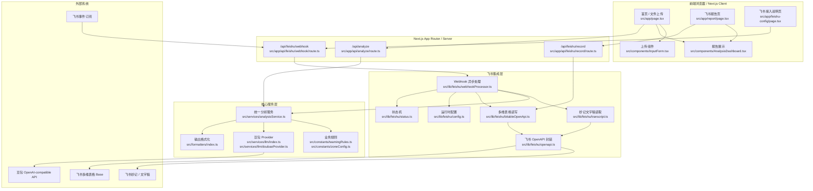
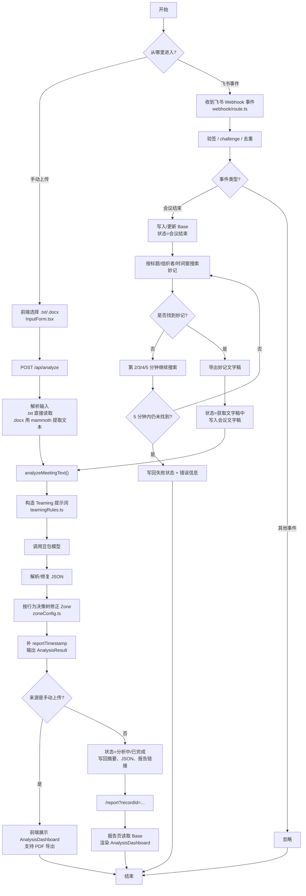
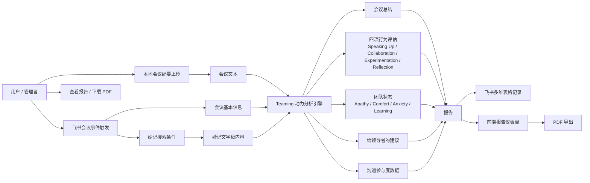
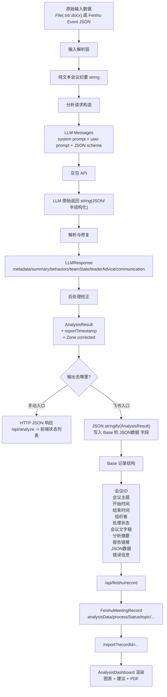

# 系统架构图

> 最后更新时间：2026-06-18

本文档基于当前仓库代码整理项目的四类图：

- 框架图
- 流程图
- 业务图
- 数据流图

当前项目保留两条业务入口：

- 手动入口：前端上传 `.txt/.docx` 文件，调用 `/api/analyze`
- 自动入口：飞书 `Webhook + OpenAPI` 自动接收事件并触发分析

两条入口共享同一套分析内核：`analysisService.ts + 豆包 Provider + Teaming/Zone 规则 + AnalysisDashboard`

---

## 一、框架图

### 说明

- 前端侧主要承担文件上传、报告展示、PDF 导出和飞书接入说明。
- 服务端由 Next.js App Router 提供 3 个核心 API：分析接口、飞书 Webhook 接口、飞书记录读取接口。
- 核心分析服务统一走豆包大模型，不区分手动入口和飞书入口。
- 飞书链路通过 OpenAPI 获取令牌、搜索妙记、导出文字稿并读写 Base 记录。

---

## 二、流程图

### 说明

- 手动链路直接以上传文件为起点，调用 `/api/analyze`。
- 飞书链路当前统一由会议结束事件驱动。
- 真正耗时的步骤包括：搜索妙记、导出文字稿、调用豆包分析、写回 Base，全部由 `webhookProcessor.ts` 异步执行。
- 两条链路在 `analyzeMeetingText()` 汇合，之后共享相同的分析流程。

---

## 三、业务图

### 说明

- 业务上系统服务两个主要场景：人工上传分析、飞书自动分析。
- 不论入口如何，最终都抽象为“会议文本 -> 团队行为诊断 -> 团队状态评估 -> 报告输出”。
- 报告既可在前端页面直接查看，也可回写飞书多维表格，并通过 `recordId` 打开详情页。

---

## 四、数据流图

### 说明

- 原始输入数据在进入统一分析服务前，都会先转成纯文本会议纪要。
- 大模型返回的原始字符串会被解析、修复，并补全为标准 `AnalysisResult`。
- 飞书链路下，`AnalysisResult` 会被序列化后写入 Base 的 `JSON数据` 字段。
- 报告页通过 `recordId` 回读 Base 记录，再恢复为可渲染的 `analysisData`。

---

## 五、代码锚点

以下文件是理解系统架构的核心入口：

- 手动入口主页：`src/app/page.tsx`
- 上传组件：`src/components/InputForm.tsx`
- 分析接口：`src/app/api/analyze/route.ts`
- 分析服务：`src/services/analysisService.ts`
- 豆包 Provider：`src/services/llm/doubaoProvider.ts`
- Zone 决策树：`src/constants/zoneConfig.ts`
- 飞书 Webhook 入口：`src/app/api/feishu/webhook/route.ts`
- 飞书异步处理：`src/lib/feishu/webhookProcessor.ts`
- 飞书 OpenAPI：`src/lib/feishu/openapi.ts`
- 多维表格读写：`src/lib/feishu/bitableOpenApi.ts`
- 报告页：`src/app/report/page.tsx`
- 报告展示组件：`src/components/AnalysisDashboard.tsx`
