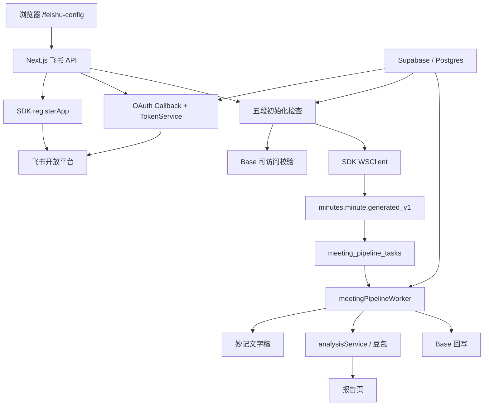
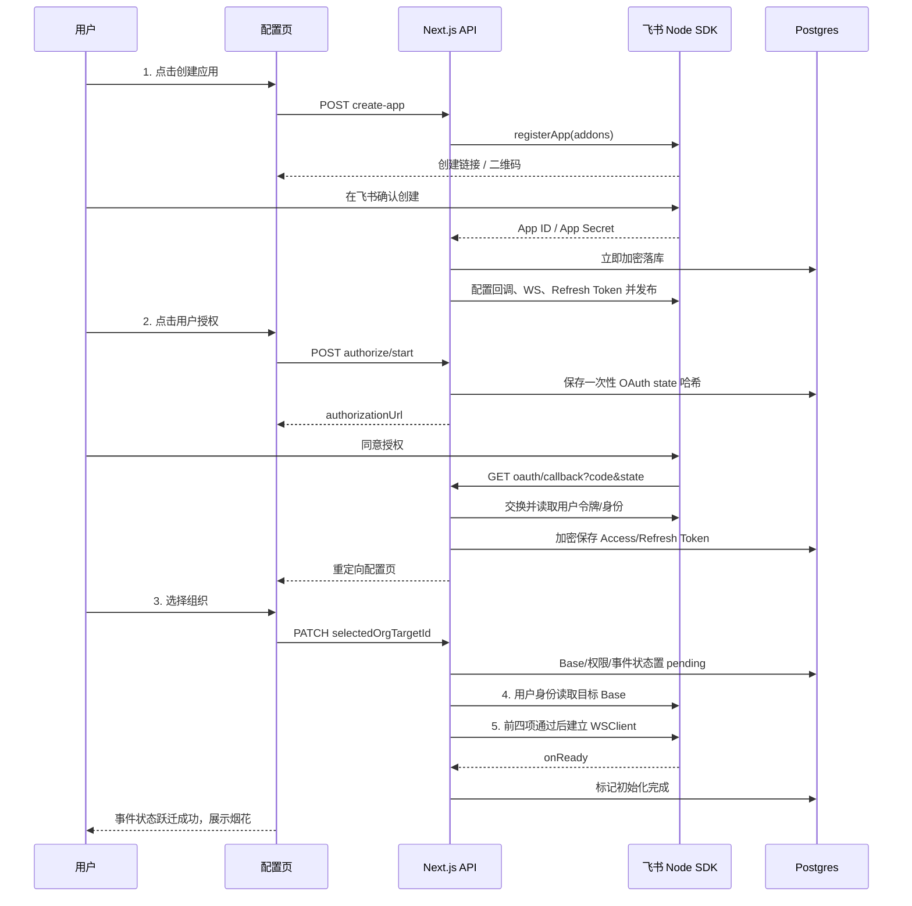

# 系统架构图

> 最后更新时间：2026-07-15

项目保留手动上传与飞书自动监听两条入口，共享分析服务和报告渲染。

## 一、框架图

## 二、初始化时序

## 三、隔离与恢复

- 每个业务调用显式传递 `integrationId` 或 `integrationContext`。
- App Secret 与 OAuth Token 按 integration 加密落库，不依赖容器目录。
- 服务启动时只为数据库五段门禁满足的 integration 恢复 WebSocket。
- 事件任务、重试和恢复以 `meeting_pipeline_tasks` 为事实来源；WebSocket Map 只是运行态缓存。
- Base 访问和报告读取都绑定当前 integration 与组织目标。
