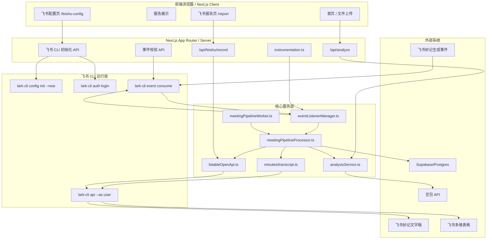
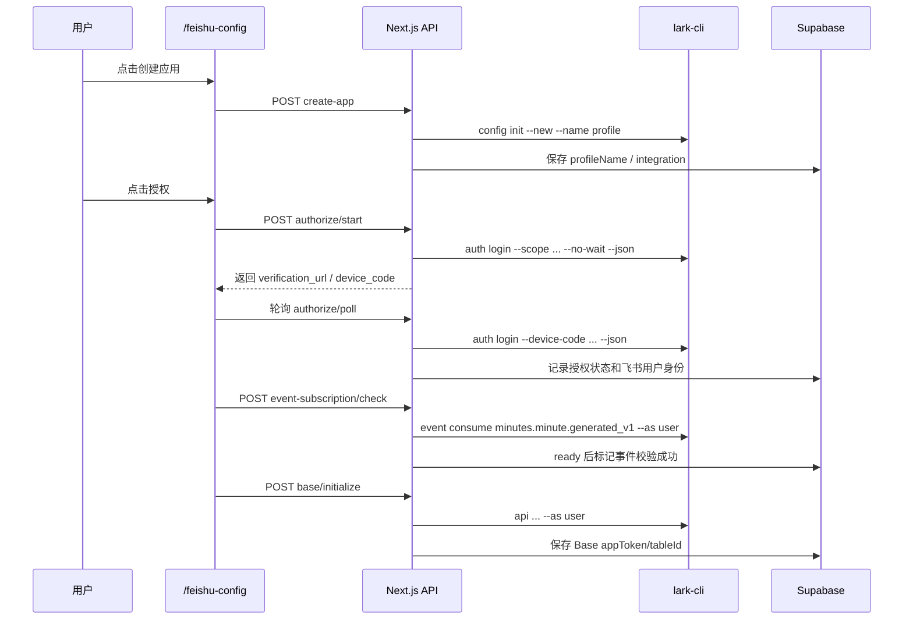
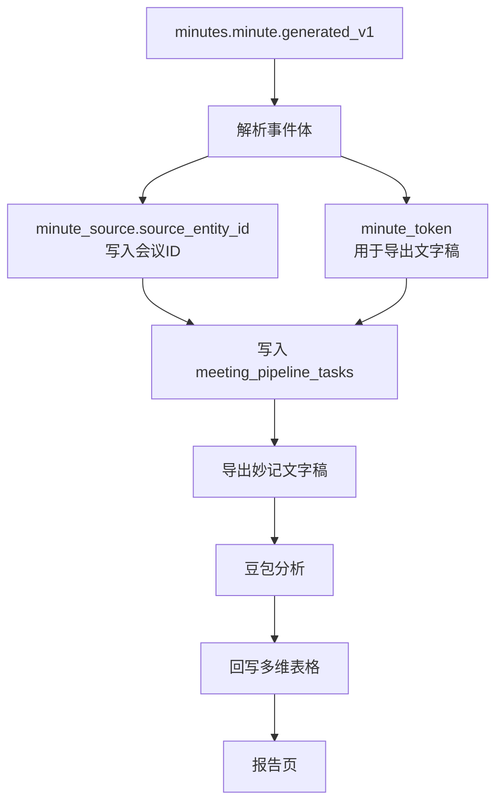

# 系统架构图

> 最后更新时间：2026-06-30

当前项目保留两条业务入口：

- 手动入口：前端上传 `.txt/.docx` 文件，调用 `/api/analyze`。
- 飞书自动入口：服务器内置飞书 CLI 监听 `minutes.minute.generated_v1` 妙记生成事件。

两条入口共享同一套分析内核：`analysisService.ts + 豆包 Provider + Teaming/Zone 规则 + AnalysisDashboard`。

## 一、框架图

## 二、飞书初始化流程

## 三、自动分析流程

## 四、数据隔离

- 每个用户创建或绑定独立 CLI profile。
- 每个请求按 `userId + integrationId` 查询集成配置，避免跨用户操作。
- 事件监听按 `integrationId/profileName` 维护独立进程状态。
- Base 写入和报告读取都带 `integrationId`，回到对应用户的多维表格。
